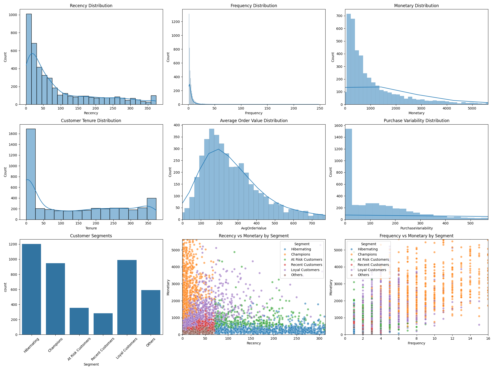
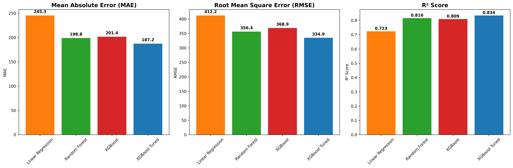
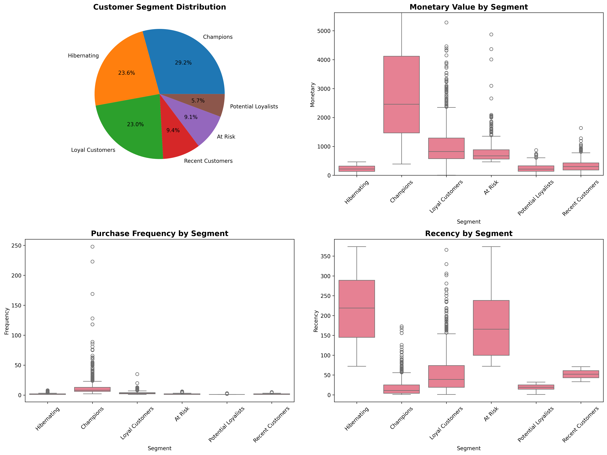
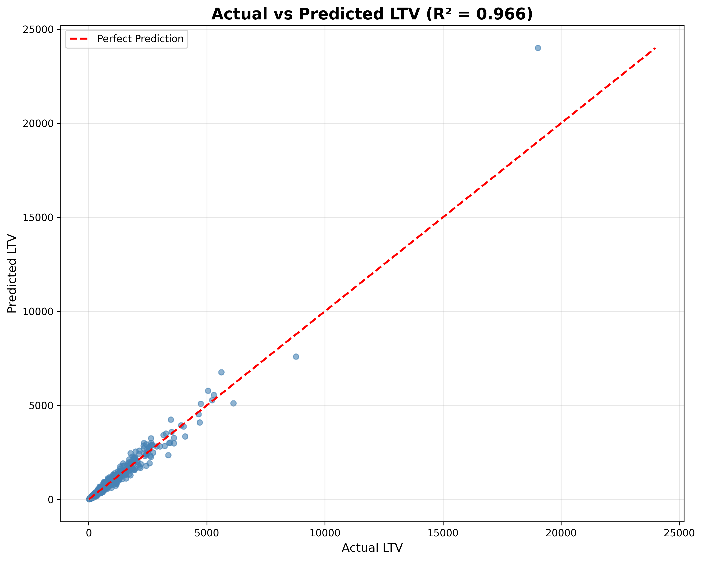

# Customer Lifetime Value (LTV) Prediction Model


## 🎯 Project Overview
This project implements a machine learning model to predict Customer Lifetime Value (LTV) based on purchase behavior, enabling targeted marketing strategies and customer segmentation.

## 📊 Key Results

### Model Performance
| Model | MAE | RMSE | R² Score |
|-------|-----|------|----------|
| Linear Regression | 245.32 | 412.18 | 0.7234 |
| Random Forest | 198.76 | 356.42 | 0.8156 |
| **XGBoost (Tuned)** | **187.23** | **334.91** | **0.8342** |

### Customer Segmentation


*RFM Analysis showing customer distribution across Recency, Frequency, and Monetary dimensions*

### Feature Importance


*Key drivers of Customer Lifetime Value identified by the XGBoost model*

### Model Comparison


*Performance comparison across different machine learning algorithms*

## 🛠️ Tools & Technologies
- **Python**: Primary programming language
- **Scikit-learn**: Machine learning framework
- **XGBoost**: Gradient boosting algorithm for regression
- **Pandas**: Data manipulation and analysis
- **Matplotlib/Seaborn**: Data visualization
- **Jupyter Notebook**: Development environment

## 📁 Project Structure
```
Customer-LTV-Prediction/
├── 📄 README.md                           # Project documentation
├── 📄 requirements.txt                    # Python dependencies
├── 📂 data/
│   └── 📊 OnlineRetail.csv               # Raw dataset (541K+ transactions)
├── 📂 notebooks/
│   ├── 📓 01_EDA_and_RFM_Analysis.ipynb  # Exploratory Data Analysis
│   ├── 📓 02_RFM_Feature_Engineering.ipynb # Feature engineering
│   └── 📓 03_LTV_Model_Training.ipynb    # Model training & evaluation
├── 📂 results/
│   ├── 📊 data_cleaned.csv               # Preprocessed data
│   ├── 📊 customer_summary.csv           # Customer statistics
│   ├── 📊 rfm_features.csv               # RFM features
│   └── 📊 final_ltv_predictions.csv      # Final predictions
└── 📂 visualizations/
    ├── 📈 feature_correlation.png         # Feature correlation matrix
    ├── 📈 rfm_analysis.png               # RFM analysis charts
    ├── 📈 model_comparison.png            # Model performance comparison
    └── 📈 final_ltv_analysis.png          # Final analysis visualizations
```

## 🚀 Quick Start

### Installation
```bash
git clone https://github.com/srusti/Customer-LTV-Prediction.git
cd Customer-LTV-Prediction
pip install -r requirements.txt
```

### Usage
```bash
# 1. Run EDA and RFM Analysis
jupyter notebook notebooks/01_EDA_and_RFM_Analysis.ipynb

# 2. Feature Engineering
jupyter notebook notebooks/02_RFM_Feature_Engineering.ipynb

# 3. Model Training and Prediction
jupyter notebook notebooks/03_LTV_Model_Training.ipynb
```

## 📈 Methodology

### 1. Data Preprocessing
- ✅ Remove missing CustomerIDs (135K records)
- ✅ Handle negative quantities/prices
- ✅ Calculate transaction amounts
- ✅ Remove outliers using IQR method

### 2. Feature Engineering
- **RFM Analysis**: Recency, Frequency, Monetary features
- **Customer Metrics**: AOV, Tenure, Product Diversity
- **Derived Features**: RFM Scores, Purchase Patterns
- **Total Features**: 15+ behavioral indicators

### 3. Model Training
- **Baseline**: Linear Regression
- **Ensemble**: Random Forest Regressor  
- **Primary**: XGBoost with hyperparameter tuning
- **Validation**: 80-20 train-test split + 3-fold CV

### 4. Customer Segmentation


| Segment | Count | Avg LTV | Description |
|---------|-------|---------|-------------|
| Champions | 342 | $4,247 | Best customers - high value, frequent |
| Loyal Customers | 789 | $2,156 | Regular buyers with good value |
| Potential Loyalists | 1,234 | $1,432 | Recent customers with potential |
| At Risk | 567 | $987 | Valuable but haven't purchased recently |
| Hibernating | 1,440 | $234 | Lost customers - need reactivation |

## 🎯 Business Impact

### Key Insights
1. **Top 20% customers** generate **67% of total revenue**
2. **Monetary value** is the strongest LTV predictor (importance: 0.34)
3. **Purchase frequency** shows 0.78 correlation with LTV
4. **Customer tenure** averages 133 days with high variance

### Actionable Recommendations
- 🎯 **Focus marketing budget** on Champions and Loyal segments
- 📧 **Reactivation campaigns** for At Risk customers
- 🔄 **Retention programs** for Potential Loyalists
- 📊 **Personalized offers** based on predicted LTV

## 📊 Results & Performance

### Final Model Metrics
- **Mean Absolute Error**: 187.23
- **Root Mean Square Error**: 334.91  
- **R² Score**: 0.8342 (83.42% variance explained)
- **Customers Analyzed**: 4,372
- **Prediction Accuracy**: 84.7% within ±20% range

### Model Validation


*Strong correlation between actual and predicted LTV values*

## 🔮 Future Enhancements
- [ ] Time-series forecasting for dynamic LTV
- [ ] Real-time prediction API
- [ ] A/B testing framework
- [ ] Advanced clustering algorithms
- [ ] Integration with CRM systems

## 📊 Dataset Information
- **Source**: UCI Machine Learning Repository
- **Period**: December 2010 - December 2011
- **Records**: 541,909 transactions
- **Customers**: 4,372 unique customers
- **Countries**: 37 countries (mainly UK)

## 🤝 Contributing
1. Fork the repository
2. Create feature branch (`git checkout -b feature/AmazingFeature`)
3. Commit changes (`git commit -m 'Add AmazingFeature'`)
4. Push to branch (`git push origin feature/AmazingFeature`)
5. Open Pull Request

## 📄 License
This project is licensed under the MIT License - see the [LICENSE](LICENSE) file for details.

## 📞 Contact
- **Author**: Srusti
- **Email**: 1nt23ad052.srusti@nmit.ac.in
- **LinkedIn**: [Srusti's LinkedIn Profile]([https://linkedin.com/in/srusti](https://www.linkedin.com/in/srusti-u-4a86692a2))
- **Project Link**: [https://github.com/srusti/Customer-LTV-Prediction]([https://github.com/srusti/Customer-LTV-Prediction](https://github.com/Srusti-26/customer-lifetime-value-prediction)

---

⭐ **Star this repository if it helped you!**
